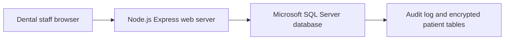
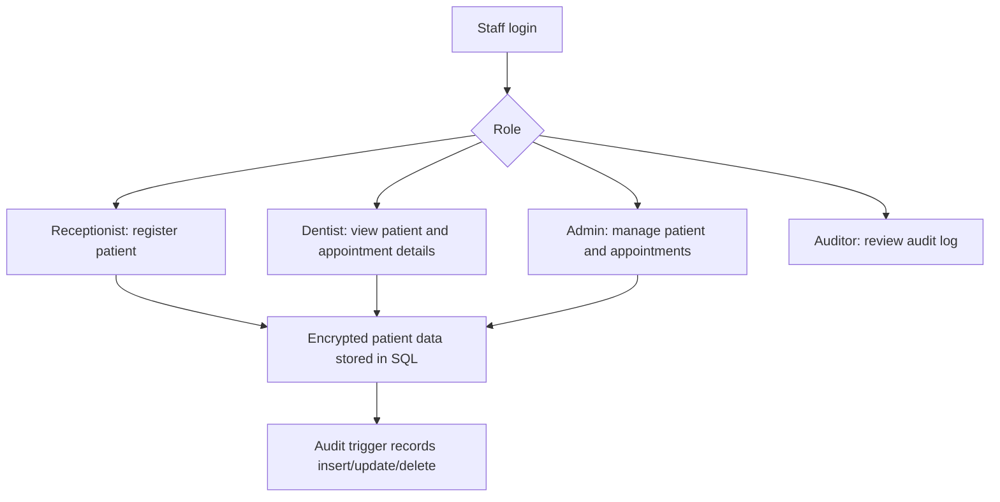
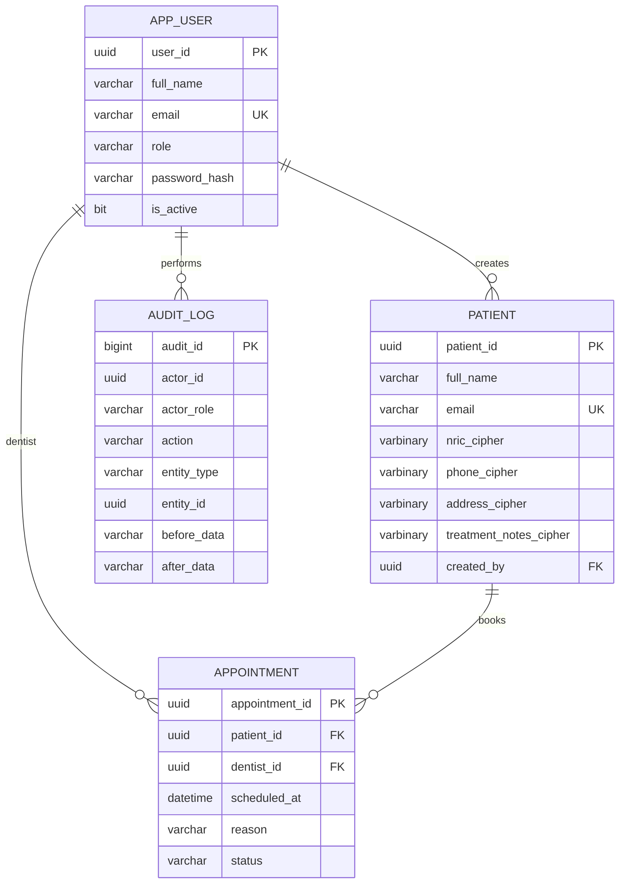

# CCS6344 T2610 Assignment 1: Database Security

## Cover Page Items To Fill

- Course: CCS6344 Database & Cloud Security
- Assignment: Assignment 1 Database Security
- Application: SecureDental Patient and Appointment System
- Group members: `[Name, Student ID]`
- YouTube presentation link: `[Paste link here]`
- GitHub repository link: `[Paste link here]`

## Task 1: Preparation of the Proposal

### 1. Project Objectives

SecureDental is a web-based dental appointment and patient-record system for a small private dental clinic in Malaysia. The business goal is to reduce manual registration, improve appointment tracking, and protect patient personal data in line with database-security practices and PDPA 2010 expectations.

The project objectives are:

1. Provide secure staff login for dental clinic administrators, dentists, receptionists, and auditors.
2. Allow authorized staff to insert, view, delete, and manage patient records.
3. Allow authorized staff to create and cancel dental appointments.
4. Protect sensitive patient data such as NRIC, phone number, address, and dental treatment notes using SQL database security controls.
5. Maintain audit logs for database changes so internal misuse can be investigated.
6. Demonstrate protection against common internal and external threats such as SQL injection, unauthorized access, data leakage, and tampering.

### 2. Proposed Design and Implementation

SecureDental uses a three-tier architecture:

Main modules:

- Authentication module: validates email and password, creates secure session cookies.
- Patient module: inserts, lists, and deletes patient records.
- Appointment module: creates and cancels appointments, with multiple seeded dentists available in the dentist dropdown.
- Audit module: allows auditor/admin users to view database change logs.
- Security module: validates input, enforces RBAC, CSRF tokens, prepared SQL statements, and database least privilege.

### 3. Hardware and Software Proposal

Recommended development environment:

| Component | Choice | Rationale |
| --- | --- | --- |
| Programming language | JavaScript, Node.js 20 | Lightweight, common for web development, easy to connect to SQL databases. |
| Web framework | Express.js | Simple routing and middleware support for authentication and security. |
| Database programme | Microsoft SQL Server 2022 / Developer Edition | Traditional SQL database with strong security features such as logins/users, views, stored procedures, encryption functions, audit triggers, and SSMS management. |
| Development OS | Windows 11 | Suitable for student development and screenshots. |
| Server OS | Windows Server or Windows 11 for local demonstration | Suitable for SQL Server, SSMS screenshots, and local student development. |
| Web server | Node.js Express behind Nginx | Express handles the application; Nginx can provide HTTPS, reverse proxying, and request limits. |
| Version control | GitHub | Required by the assignment and useful for contribution tracking. |

Minimum deployment hardware:

| Resource | Minimum |
| --- | --- |
| CPU | 2 vCPU |
| RAM | 4 GB |
| Storage | 40 GB SSD |
| Network | HTTPS-enabled public endpoint or local demonstration network |

### 4. System and Database Design

Main workflow:

Entity relationship design:

### 5. SQL Database Security Plan

Security measures planned for the SQL database:

- Least privilege SQL Server logins/users: `dental_app`, `dental_readonly`, and `dental_auditor`.
- Grant only required views and stored procedures to each database user.
- Sensitive patient fields are encrypted using SQL Server passphrase encryption.
- Application uses prepared statements with placeholders, not string-concatenated SQL.
- Stored procedures control insert, delete, appointment creation, and appointment cancellation.
- Audit triggers record patient and appointment changes.
- Role-based access control separates admin, dentist, receptionist, and auditor.
- Session cookies are HTTP-only and SameSite strict.
- CSRF token is required for state-changing requests.
- Input validation blocks invalid NRIC, phone, email, and empty fields.
- Security events are logged when application errors or permission failures occur.

## Task 2: Implementation of the Application Using SQL Database

### Design Description

The implementation is located in the project repository:

- `public/`: frontend pages and browser JavaScript.
- `src/`: Express server, database connection, validation, and security middleware.
- `db/`: SQL Server schema, users, encryption, audit procedures, seed users including four dentists, and security tests.

Implementation flow:

1. Staff opens the SecureDental web interface.
2. Staff logs in using seeded role-based account.
3. The web server verifies the password hash and creates a secure session.
4. Frontend requests patient/appointment data through JSON APIs.
5. Express validates input and checks permissions.
6. Express sends parameterized SQL to SQL Server.
7. SQL Server stored procedures write encrypted data and audit triggers record changes.
8. After a new patient is inserted, the interface reloads the patient table, scrolls to the Patients section, and highlights the newly inserted row for clear screenshot evidence.

### Step-by-Step Implementation Evidence

Use screenshots for these steps:

1. Show project files in the editor.
2. Show SQL Server database initialization command or SSMS script execution.
3. Show successful app startup at `http://localhost:3000`.
4. Show login as receptionist.
5. Show inserting a new patient and the highlighted patient-table row.
6. Show creating an appointment using one of the seeded dentists from the dropdown.
7. Show deleting one patient or cancelling one old appointment.
8. Show inserting another new patient.
9. Show login as auditor and audit log output.
10. Show security test command output.

### Required Functional Tests

| Test | Expected Result | Screenshot Required |
| --- | --- | --- |
| Insert new entry | Patient appears in patient table, the new row is highlighted, and audit log records INSERT. | Yes |
| Delete one old entry | Deleted record disappears and audit log records DELETE. | Yes |
| Insert another new entry | Second patient appears and audit log records INSERT. | Yes |
| Create appointment | Appointment appears with scheduled status and selected dentist. | Yes |
| Cancel appointment | Appointment status changes to cancelled. | Yes |

## Task 3: Threat Modelling

### STRIDE Analysis

| STRIDE Category | Threat Example | Security Control | Justification |
| --- | --- | --- | --- |
| Spoofing | Attacker logs in as dental staff using stolen credentials. | Password hashing, secure sessions, role checks. | Passwords are not stored in plain text and every API verifies the authenticated session. |
| Tampering | User changes patient ID or appointment ID in requests. | RBAC middleware, SQL stored procedures, audit triggers. | Unauthorized operations are rejected and all changes are recorded. |
| Repudiation | Staff denies deleting a patient record. | `audit_log` records actor role, action, entity, and timestamp. | The database keeps evidence of changes for investigation. |
| Information disclosure | Receptionist views dental treatment notes unnecessarily. | `patient_safe_view` restricts notes to dentists/admins. | Views reduce accidental disclosure based on user role. |
| Denial of service | Large request body or repeated invalid requests. | JSON body limit, validation, Nginx/request limits for deployment. | Oversized input is blocked and production proxy can rate-limit requests. |
| Elevation of privilege | App role tries direct table access. | Grants limited to views and stored procedures. | `dental_app` cannot directly read encrypted base tables. |

### DREAD Scoring

Scale: 1 = low, 5 = high.

| Threat | Damage | Reproducibility | Exploitability | Affected Users | Discoverability | Total /25 | Risk |
| --- | ---: | ---: | ---: | ---: | ---: | ---: | --- |
| SQL injection against patient form | 5 | 4 | 3 | 5 | 4 | 21 | High |
| Stolen receptionist session | 4 | 3 | 3 | 4 | 3 | 17 | Medium |
| Direct database table access by app role | 5 | 2 | 2 | 5 | 3 | 17 | Medium |
| Unauthorized treatment-note viewing | 4 | 3 | 2 | 4 | 3 | 16 | Medium |
| Audit log deletion by normal user | 4 | 2 | 2 | 4 | 2 | 14 | Medium |
| Brute-force login attempts | 3 | 4 | 3 | 3 | 4 | 17 | Medium |

Detailed DREAD justification:

| Threat | Damage Rationale | Reproducibility Rationale | Exploitability Rationale | Affected Users Rationale | Discoverability Rationale |
| --- | --- | --- | --- | --- | --- |
| SQL injection against patient form | Damage is 5 because a successful injection against patient insert/query logic could expose or modify encrypted patient records, appointments, or audit evidence. | Reproducibility is 4 because patient and appointment forms are repeatable web inputs, even though the current implementation uses parameterized SQL and stored procedures. | Exploitability is 3 because an attacker can submit crafted form values, but the Express API binds values through the `mssql` driver and SQL Server procedures. | Affected users is 5 because a database-level compromise could affect all patient records stored in `dbo.patient` and related appointments. | Discoverability is 4 because input fields and API routes are visible in the browser, but the actual database schema and procedure permissions are not exposed publicly. |
| Stolen receptionist session | Damage is 4 because a receptionist can create/delete patients and schedule/cancel appointments, which can disrupt clinic records. | Reproducibility is 3 because session theft requires access to the browser/session cookie or a client-side compromise. | Exploitability is 3 because cookies are HTTP-only and SameSite strict, but an attacker with a stolen active session can reuse the authorized workflow. | Affected users is 4 because a receptionist has broad operational access to many patient and appointment records, although not audit administration. | Discoverability is 3 because the role capabilities become clear after login, but session controls are not directly visible to an outside attacker. |
| Direct database table access by app role | Damage is 5 because direct table access could bypass views, stored procedures, encryption rules, and audit assumptions. | Reproducibility is 2 because it requires database credential access, SQL Server network access, and knowledge of the schema. | Exploitability is 2 because `dental_app` is granted only approved views and stored procedures, not direct patient-table reads. | Affected users is 5 because bypassing database least privilege could expose the full clinic dataset. | Discoverability is 3 because connection settings are environment-based and schema names can be inferred from code, but direct grants must still be tested at SQL Server. |
| Unauthorized treatment-note viewing | Damage is 4 because dental treatment notes are sensitive health-related data and may reveal medical conditions or procedures. | Reproducibility is 3 because a logged-in staff user may repeatedly request patient lists, but access depends on role and SQL session context. | Exploitability is 2 because `patient_safe_view` restricts treatment notes and the backend now blocks auditors from patient endpoints entirely. | Affected users is 4 because disclosure could apply to many patients in the latest table results. | Discoverability is 3 because treatment-note fields are visible in the UI for allowed roles, but unauthorized users must bypass role checks to see them. |
| Audit log deletion by normal user | Damage is 4 because losing audit history weakens repudiation controls and investigation evidence. | Reproducibility is 2 because there is no UI or API route for deleting audit logs. | Exploitability is 2 because normal roles receive no stored procedure or route for audit deletion, and database grants are read-limited. | Affected users is 4 because audit loss affects accountability for all patient and appointment changes. | Discoverability is 2 because audit tables are mentioned in documentation, but deletion paths are not exposed through the application. |
| Brute-force login attempts | Damage is 3 because a successful password guess gives role-based access but not direct database administrator control. | Reproducibility is 4 because login attempts can be repeated against `/api/login`. | Exploitability is 3 because seeded demo passwords are known for the assignment, while production passwords should be changed and are stored as scrypt hashes. | Affected users is 3 because compromise is limited to the guessed account role, although admin or receptionist compromise has higher operational impact. | Discoverability is 4 because the login form and seeded demo accounts are documented for the class demonstration. |

## Task 4: PDPA 2010 Compliance

### PDPA Personnel Categorization

| SecureDental Personnel | PDPA Category | Reason |
| --- | --- | --- |
| Patient | Data subject | The patient is the individual whose personal data is processed. |
| Dental clinic owner/admin | Data user | The dental clinic controls why and how patient data is processed. |
| Dentist | Authorized personnel under data user | Dentist uses patient data to provide treatment. |
| Receptionist | Authorized personnel under data user | Receptionist collects registration and appointment information. |
| Cloud/database hosting provider | Data processor | Provider may process/store data on behalf of the dental clinic. |
| Internal auditor | Authorized compliance personnel | Auditor reviews logs and compliance evidence. |

### Data Lifecycle Compliance Mapping

| Lifecycle Stage | PDPA Requirement | SecureDental Compliance Control | Responsible Personnel |
| --- | --- | --- | --- |
| Collection | Collect only necessary personal data and notify the data subject. | Registration form collects name, email, NRIC, phone, address, and dental treatment notes only for dental service. Privacy notice should be shown at registration. | Receptionist, Admin |
| Storage | Protect personal data from loss, misuse, unauthorized access, modification, or disclosure. | Encrypted SQL fields, database roles, HTTPS deployment, backups with restricted access. | Admin, Database administrator |
| Use | Use personal data only for the purpose collected. | Role-based access: dentists see dental treatment notes; receptionist handles registration and appointments. | Dentist, Receptionist |
| Disclosure | Do not disclose without consent or lawful basis. | No public export; auditor sees logs, not unnecessary full patient details. | Admin |
| Retention | Do not keep data longer than necessary. | Add retention policy to archive or remove inactive patient records after the dental clinic-defined period. | Admin, Compliance officer |
| Access/Correction | Allow data subject to request access/correction. | Staff can update patient records after identity verification. | Receptionist, Admin |
| Disposal | Securely delete or anonymize data when no longer needed. | Database delete function and audit record of deletion. Backups should expire according to retention policy. | Admin, Database administrator |

### Penalties for Non-Compliance

The penalty mapping below is based on Malaysia Personal Data Protection Act 2010 (Act 709). Section 5 lists the seven Personal Data Protection Principles in sections 6 to 12 and states that a data user who contravenes those principles is liable to a fine not exceeding RM300,000, imprisonment for a term not exceeding two years, or both.

| Lifecycle Stage | Relevant PDPA Section | Violation Example In SecureDental | Exact Penalty | Responsible Personnel |
| --- | --- | --- | --- | --- |
| Collection | Section 5(2), read with sections 6 and 7 | Collecting patient NRIC, phone, address, or dental notes without valid purpose, consent, or privacy notice. | Fine up to RM300,000, imprisonment up to two years, or both. | Receptionist, Admin |
| Storage and security | Section 5(2), read with section 9 | Failing to protect patient data from loss, misuse, modification, unauthorized access, accidental disclosure, alteration, or destruction. | Fine up to RM300,000, imprisonment up to two years, or both. | Admin, Database administrator |
| Use of patient data | Section 5(2), read with sections 6 and 12 | Using patient data for purposes outside dental registration, treatment, appointment management, audit, or permitted correction/access workflows. | Fine up to RM300,000, imprisonment up to two years, or both. | Dentist, Receptionist, Admin |
| Sensitive treatment data | Section 40(3) | Processing sensitive health or dental-treatment data without explicit consent or another permitted basis under section 40. | Fine up to RM200,000, imprisonment up to two years, or both. | Dentist, Admin |
| Disclosure | Section 5(2), read with section 8 | Disclosing patient data to a party or purpose not stated at collection and not otherwise permitted. | Fine up to RM300,000, imprisonment up to two years, or both. | Admin, Dentist, Receptionist |
| Unlawful collection or disclosure | Section 130(7) | Knowingly or recklessly collecting, disclosing, procuring disclosure, selling, or offering to sell personal data without the data user's consent. | Fine up to RM500,000, imprisonment up to three years, or both. | Any staff member, contractor, or outsider involved |
| Retention | Section 5(2), read with section 10 | Keeping inactive patient data longer than necessary for dental service, audit, legal, or clinic-retention requirements. | Fine up to RM300,000, imprisonment up to two years, or both. | Admin, Compliance officer, Database administrator |
| Access and correction | Section 5(2), read with section 12; section 37(4) for correction-note failures | Failing to support patient access/correction rights or failing to attach the required note when refusing correction of an opinion-based record. | Section 5(2): fine up to RM300,000, imprisonment up to two years, or both. Section 37(4): fine up to RM100,000, imprisonment up to one year, or both. | Receptionist, Admin |
| Preventing harmful processing | Section 42(6) | Failing to comply with a Commissioner requirement after a data subject objects to processing likely to cause substantial damage or distress. | Fine up to RM200,000, imprisonment up to two years, or both. | Admin, Compliance officer |
| Cross-border transfer | Section 129(5) | Transferring patient data to another country without meeting PDPA transfer requirements. | Fine up to RM300,000, imprisonment up to two years, or both. | Admin, Cloud/database hosting manager |
| Enforcement notice | Section 108(8) | Failing to comply with an enforcement notice from the Commissioner. | Fine up to RM200,000, imprisonment up to two years, or both. | Admin, Clinic owner, Compliance officer |

Section 133 also allows corporate officers such as directors, chief executive officers, managers, secretaries, or similar officers to be charged jointly with the body corporate. They may be deemed to have committed the offence unless they prove that it happened without their knowledge, consent, or connivance and that they exercised due diligence to prevent it.

## Task 5: Security Measures Implementation

Implemented security controls:

| Control | Implementation Evidence |
| --- | --- |
| SQL Server users and least privilege | `db/01_security.sql` creates `dental_app`, `dental_auditor`, and `dental_readonly`; grants are limited to approved views and procedures. |
| Encryption | Patient NRIC, phone, address, and dental treatment notes are encrypted using `ENCRYPTBYPASSPHRASE`. |
| Views | `patient_safe_view` decrypts fields only through controlled access and restricts dental treatment notes by role. |
| Stored procedures | `create_patient`, `delete_patient`, `create_appointment`, and `cancel_appointment` enforce role checks in SQL. |
| Audit trail | Database triggers insert into `audit_log` after patient and appointment changes. |
| Parameterized statements | Express passes parameters through the `mssql` driver instead of concatenating user input into SQL. |
| Input validation | `src/validators.js` validates email, NRIC, phone, and text length. |
| Authentication | Passwords are hashed using scrypt and verified with timing-safe comparison. |
| Authorization | `src/security.js` maps explicit read/write permissions to admin, dentist, receptionist, and auditor. Auditors receive only `audit:read`, so patient and appointment API routes return permission denied. |
| CSRF protection | State-changing API calls require `x-csrf-token`. |
| Session protection | Cookies are HTTP-only, SameSite strict, and secure in production. |
| Error/security logging | Application errors are written to `security_event`. |

Internal attack protection:

- Staff cannot perform actions outside their assigned role.
- Auditor can view logs only and cannot access patient or appointment API data.
- Direct base table access is denied to the application role.
- Audit log records who performed inserts, updates, and deletes.

External attack protection:

- SQL injection is mitigated by parameterized statements and stored procedures.
- CSRF tokens protect state-changing requests.
- Input validation blocks malformed or oversized values.
- Production deployment should use HTTPS through Nginx.
- Database credentials are stored in environment variables, not source code.

Security test screenshots to include:

1. Failed direct table access using `dental_app`.
2. SQL injection test input stored as text while `patient` table remains.
3. Audit log showing INSERT/DELETE entries.
4. Browser showing permission denied when auditor attempts non-auditor functions.

## Task 6: Presentation

The 10-minute video should cover:

1. Project objective and business model.
2. Architecture and database design.
3. Application demo: login, insert patient, schedule appointment, delete/cancel, insert another record.
4. Database security controls.
5. STRIDE and DREAD summary.
6. PDPA 2010 compliance mapping.
7. GitHub repository and conclusion.

All members should speak. A balanced plan for three members:

| Member | Suggested Section |
| --- | --- |
| Member 1 | Introduction, objectives, business model, architecture |
| Member 2 | Demo, database design, implementation steps |
| Member 3 | Security controls, STRIDE/DREAD, PDPA, conclusion |

## References

- Personal Data Protection Act 2010 (Act 709), Malaysia: https://www.pdp.gov.my/ppdpv1/en/akta/pdp-act-2010-en/
- Microsoft Learn: SQL Server security, users, roles, permissions, and encryption functions.
- OWASP Cheat Sheet Series: SQL Injection Prevention.
- OWASP Cheat Sheet Series: Session Management.
